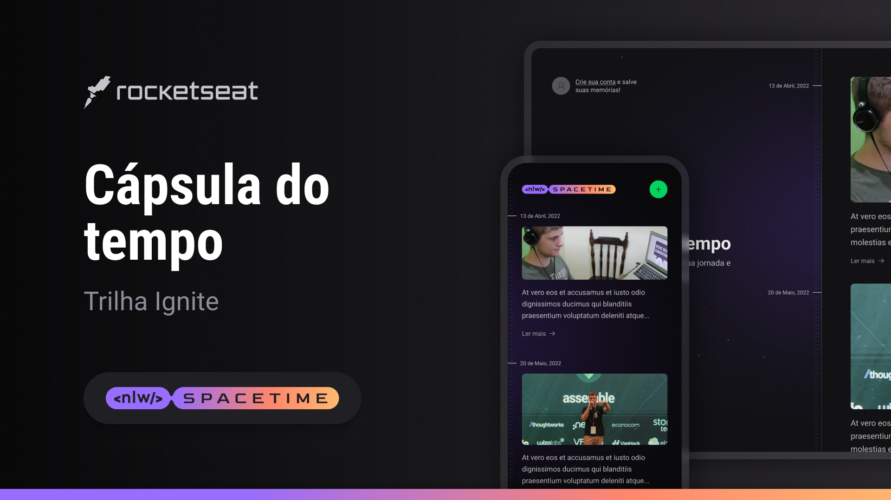

<div align="center">

<h1> NLW Spacetime </h1>
</div>

<p align="center">
Uma aplicação full-stack, do back-end ao mobile, que funcionará como uma cápsula do tempo guardando memórias passadas numa timeline. Utilizando React, Tailwind, Node, Fastify, TypeScript, Expo, Next.js e muito mais! <br/>
<a href="https://www.rocketseat.com.br/ignite">Saiba mais sobre o Ignite clicando aqui.</a>
</p>

<p align="center">
  <a href="#-tecnologias">Tecnologias</a>&nbsp;&nbsp;&nbsp;|&nbsp;&nbsp;&nbsp;
  <a href="#-projeto">Projeto</a>&nbsp;&nbsp;&nbsp;|&nbsp;&nbsp;&nbsp;
  <a href="#-layout">Layout</a>&nbsp;&nbsp;&nbsp;|&nbsp;&nbsp;&nbsp;
  <a href="#-instalação">Instalação</a>&nbsp;&nbsp;&nbsp;|&nbsp;&nbsp;&nbsp;
  <a href="#memo-licença">Licença</a>&nbsp;&nbsp;&nbsp;|&nbsp;&nbsp;&nbsp;
</p>

<p align="center">
  
</p>

<br>

<p align="center">
  
</p>

## 🚀 Tecnologias

Esse projeto foi desenvolvido com as seguintes tecnologias:

- Javascript
- Typescript
- React
- Next.js
- Taildwind
- React Native
- Expo
- Node.js
- Figma

## 💻 Projeto

Uma aplicação full-stack, do back-end ao mobile, que funcionará como uma cápsula do tempo guardando memórias passadas numa timeline. Utilizando React, Tailwind, Node, Fastify, TypeScript, Expo, Next.js e muito mais!


<!-- - [Acesse o deploy do projeto, na Vercel](https://florenciomath-coffeedelivery.vercel.app/) -->


## 🔖 Layout

Você pode visualizar o layout do projeto através [DESSE LINK](https://www.figma.com/community/file/1240070456276424762). É necessário ter conta no [Figma](https://figma.com) para acessá-lo.


## 🪛 Instalação 

### Pré-requisitos

* npm
```sh
 npm install npm@latest -g
````

### Instalação

1. Clone o repositório
```sh
https://github.com/florencioMath/Challenge-NLWSpacetime.git
```
2. Entre nas pastas 'server, web e mobile' e instale as dependências
```sh
$ cd server
$ npm install

$ cd web
$ npm install

$ cd mobile
$ npm install
```
3. Inicie o projeto
```sh
- web e server
$ npm run dev

- mobile
$ npm run start
```
4. Abra no navegador 
```txt
http://localhost:3000/
```

## :memo: Licença

Esse projeto está sob a licença MIT.

---

Feito com 🖤 by Matheus Florêncio :wave:
